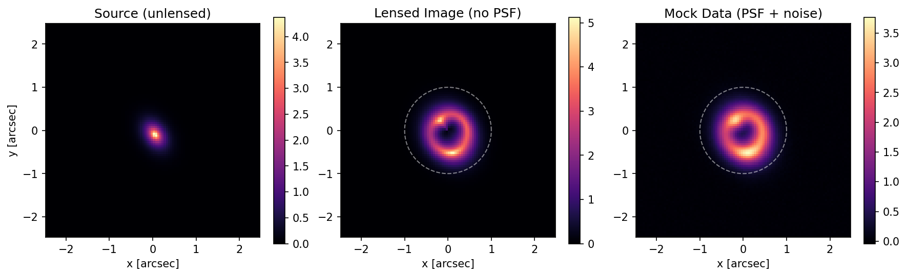
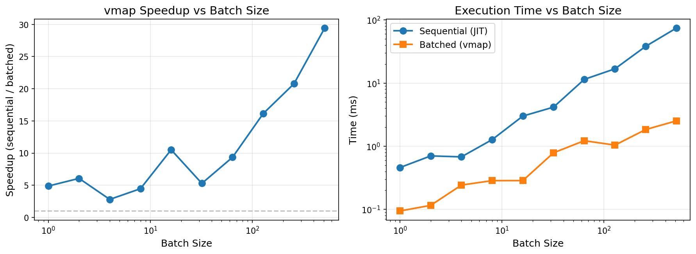

# jax_lens

A JAX-native implementation of gravitational lensing calculations, designed for efficient batched inference via `vmap` and automatic differentiation via `grad`.


*Einstein ring simulation: (left) unlensed source galaxy, (center) gravitationally lensed image, (right) mock observation with PSF convolution and noise.*

## Overview

`jax_lens` is a functional reimplementation of core [PyAutoLens](https://github.com/Jammy2211/PyAutoLens) functionality in pure JAX. It provides:

- **Light profiles**: Sersic, Exponential, Gaussian, de Vaucouleurs
- **Mass profiles**: SIS, SIE, NFW, Power Law, External Shear
- **Cosmology**: Flat ΛCDM distance calculations
- **Ray tracing**: Single and multi-plane lensing
- **Fitting**: Likelihood calculations with PSF convolution

All functions are pure JAX and compatible with `jit`, `vmap`, and `grad` transformations.

## Installation

```bash
pip install jax jaxlib
# Then add jax_lens to your path or install in development mode
```

## Quick Start

```python
import jax.numpy as jnp
from jax_lens.profiles import light, mass
from jax_lens.lens.tracer import simple_tracer_image

# Create a grid
n = 100
coords = jnp.stack(jnp.meshgrid(
    jnp.linspace(-2.5, 2.5, n),
    jnp.linspace(-2.5, 2.5, n),
    indexing='ij'
), axis=-1).reshape(-1, 2)

# Define lens and source parameters
lens_params = {
    "centre": jnp.array([0.0, 0.0]),
    "einstein_radius": 1.0,
    "axis_ratio": 0.8,
    "angle": 0.5,
}

source_params = {
    "centre": jnp.array([0.1, 0.05]),
    "intensity": 1.0,
    "effective_radius": 0.3,
    "sersic_index": 1.0,
}

# Generate lensed image
lensed_image = simple_tracer_image(
    grid=coords,
    lens_mass_params=lens_params,
    source_light_params=source_params,
    lens_mass_type="sie",
    source_light_type="sersic",
).reshape(n, n)
```

For a complete example with visualization, see [`examples/demo_lensing.py`](examples/demo_lensing.py):

```bash
python examples/demo_lensing.py
```

This generates the Einstein ring figure shown at the top of this README.

## Batched Inference

The key advantage of jax_lens is efficient batched evaluation via `vmap`:

```python
from jax import vmap, jit

# Define lens model for single parameter set
def lens_model(einstein_radius):
    lens_params = {"centre": jnp.array([0.0, 0.0]), "einstein_radius": einstein_radius, ...}
    return simple_tracer_image(grid, lens_params, source_params, "sie", "sersic")

# Vectorize over MCMC walkers
batched_lens = jit(vmap(lens_model))
results = batched_lens(einstein_radii)  # Shape: (n_walkers, n_pixels)
```



Speedup increases with batch size, reaching **~30× at 512 samples** on CPU. The right panel shows sequential time scales linearly while batched evaluation remains nearly constant.

Run the benchmarks:
```bash
python benchmark_batching.py  # Generate the plot above
python test_batching.py       # Quick validation tests
```

## Validation

The implementation has been validated pixel-by-pixel against PyAutoLens:

| Profile | Max Difference | Status |
|---------|----------------|--------|
| Sersic  | 1.3e-05 (rel)  | ✓ PIXEL-PERFECT |
| SIS     | 1.9e-07 (abs)  | ✓ PIXEL-PERFECT |
| SIE     | 3.5e-07 (abs)  | ✓ PIXEL-PERFECT |

Run the comparison yourself:
```bash
python compare_implementations.py
```

## AI-Assisted Development

This project was developed using an AI-assisted workflow with Claude Code and Gemini.

### Development Process

1. **Codebase Analysis**: Used `code2prompt` to generate a comprehensive summary of PyAutoLens, then asked Gemini 3 Pro to analyze the JAX compatibility of the existing code.

2. **Implementation Planning**: Gemini 3 Pro created a detailed implementation plan (`pyautolens_jax_native_implementation_plan.md`) with:
   - Architecture decisions (functional vs OOP)
   - Profile-by-profile implementation strategy
   - Code examples for each component

3. **Implementation**: Claude Code implemented the plan, creating:
   - Light profiles with Sersic b_n approximation
   - Mass profiles following Kormann et al. (1994) for SIE
   - Cosmological distance calculations
   - Ray tracing with PyTree parameter structures

4. **Iterative Review**: Used Gemini 3 Pro to review the implementation against PyAutoLens:
   - **Round 1**: Found missing External Shear profile, convolution padding issues
   - **Round 2**: Found External Shear sign error, integration precision not configurable
   - **Round 3**: APPROVED

5. **Pixel-Perfect Validation**: Compared outputs directly against PyAutoLens:
   - Identified SIE Einstein radius rescaling convention difference
   - Used GPT-5.1 to analyze the exact formula difference
   - Fixed to match PyAutoLens convention: `einstein_radius_rescaled = einstein_radius / (1 + axis_ratio)`

### Tools Used

- **Claude Code (Opus 4.5)**: Primary implementation and debugging
- **Gemini 3 Pro**: Architecture planning and code review
- **GPT-5.1**: Debugging specific formula differences
- **code2prompt**: Codebase summarization for LLM context

### Key Insights

The main challenge was matching PyAutoLens conventions exactly:

1. **Sersic b_n**: Both use the same approximation formula - matched to floating point precision

2. **SIE Einstein radius**: PyAutoLens uses a "rescaled" Einstein radius for the isothermal ellipsoid:
   ```python
   # PyAutoLens convention (slope=2 isothermal)
   einstein_radius_rescaled = einstein_radius / (1 + axis_ratio)
   factor = 2 * einstein_radius_rescaled * axis_ratio / sqrt(1 - axis_ratio²)
   ```

3. **Coordinate convention**: Both use (y, x) ordering with position angle measured counter-clockwise from +x axis

## Project Structure

```
├── jax_lens/
│   ├── __init__.py
│   ├── profiles/
│   │   ├── light.py          # Sersic, Gaussian, Exponential
│   │   └── mass.py           # SIS, SIE, NFW, Power Law, External Shear
│   ├── cosmology/
│   │   └── distances.py      # Flat ΛCDM distances
│   ├── lens/
│   │   └── tracer.py         # Ray tracing
│   ├── fitting/
│   │   └── imaging.py        # Likelihood, convolution
│   └── tests/
│       └── test_profiles.py  # 18 unit tests
├── examples/
│   └── demo_lensing.py       # Generate lens_demo.png
├── compare_implementations.py # PyAutoLens validation
└── lens_demo.png              # Example output
```

## License

MIT

## Acknowledgments

- [PyAutoLens](https://github.com/Jammy2211/PyAutoLens) - Reference implementation
- [JAX](https://github.com/google/jax) - Autodiff and compilation
